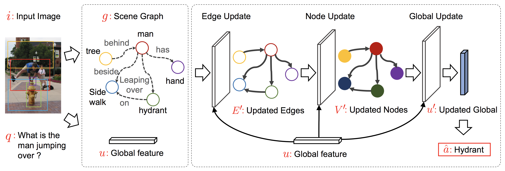

#Leveraging Scene Graphs for Visual QA

Tensorflow code for our BMVC 2019 paper "An Empirical Study on Leveraging Scene Graphs for Visual Question Answering"


We will release the code and data soon.


## Citation
```
@inproceedings{zhang2019empirical,
  title={An Empirical Study on Leveraging Scene Graphs for Visual Question Answering},
  author={Zhang, Cheng and Chao, Wei-Lun and Xuan, Dong},
  booktitle={British Machine Vision Conference (BMVC)},
  year={2019}
}
```

